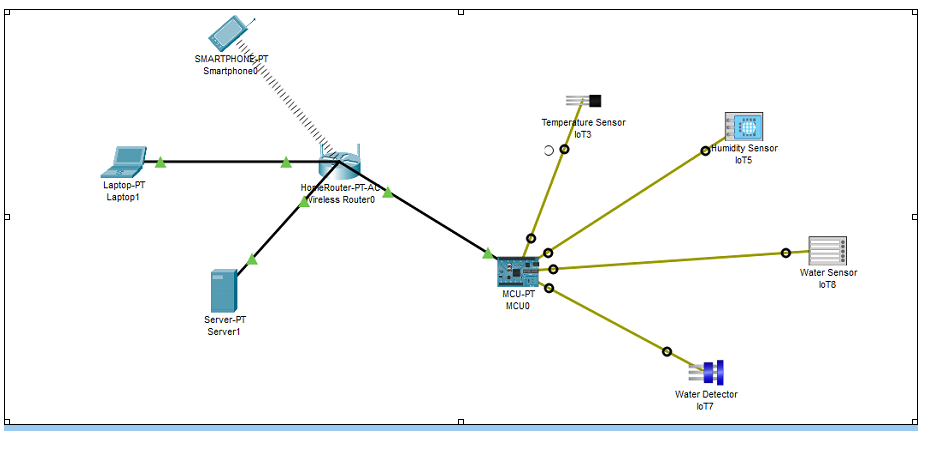
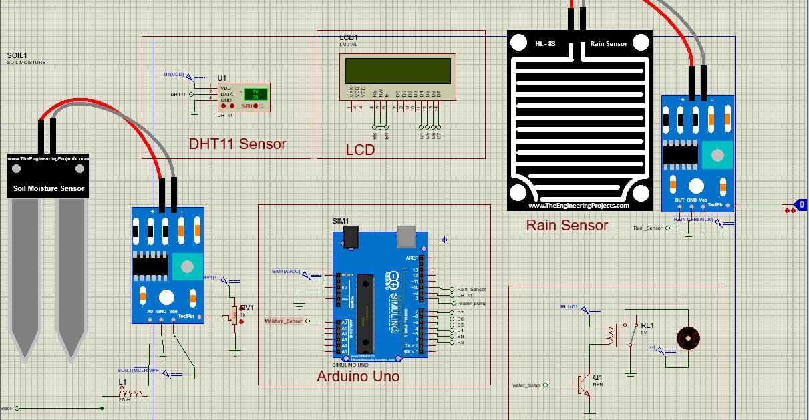
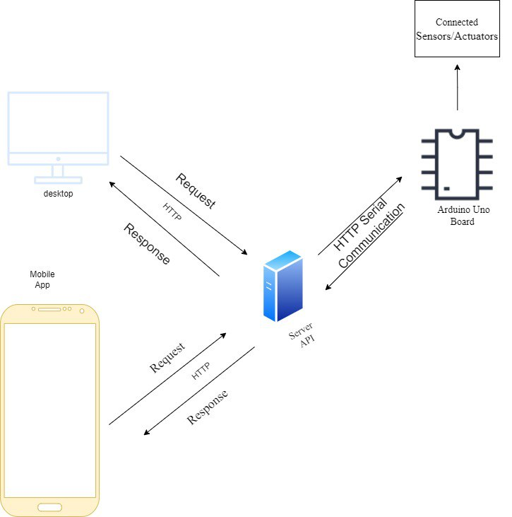

# IoT-Based Smart Agriculture to optimize water usage

Freshwater scarcity is a growing threat worldwide, and agriculture is a major consumer of this precious resource. Traditional irrigation methods can be wasteful, leading to water loss through evaporation and runoff. This is where Smart Agriculture comes in, offering a data-driven approach to optimize water usage and ensure sustainable farming practices. 
Smart Agriculture leverages technologies like sensors, automation, and artificial intelligence to create intelligent irrigation systems. These systems collect real-time data on factors like soil moisture, weather conditions, and crop health. By analyzing this data, they can precisely tailor water delivery to the specific needs of each plant, at the right time and in the right amount. 
## objective

Smart Agriculture, when applied to water usage, has a clear set of objectives aimed at improving efficiency and sustainability in the agricultural sector. Here are the key goals: 
Reduce Water Waste: The primary objective is to significantly minimize water wastage during irrigation. This is achieved by delivering water only when and where it is needed by the crops, based on real-time data. 
- **Optimize Irrigation Practices:** Smart irrigation systems aim to move away from blanket irrigation methods and tailor water application to the specific needs of each crop variety and growth stage. 
- **Increase Water Efficiency:** By optimizing irrigation practices, Smart Agriculture seeks to achieve "more crop per drop," maximizing crop yield while minimizing water consumption. 
- **Enhance Crop Health and Productivity:** Precise irrigation ensures that crops receive the optimal amount of water for healthy growth, potentially leading to increased yields and improved crop quality. 
- **Minimize Environmental Impact:** Reduced water use translates to a lower environmental footprint. This includes minimizing water table depletion, soil erosion, and salinization often associated with excessive irrigation. 
- **Improve Farm Management Decisions:** The data collected by Smart irrigation systems empowers farmers to make informed decisions about water allocation, resource management, and overall farm operations. 
These objectives highlight the multi-faceted benefits of Smart Agriculture for water optimization. It is not just about saving water; it is about creating a more sustainable and productive agricultural system that benefits both farmers and the environment. 

### Materials and Methodologies

### IoT field sensors:

- **Temperature Sensor**: Monitoring temperature is crucial as it affects plant growth, development. (DHT11)

- **Humidity Sensor**: Humidity levels influence evaporation rates, soil moisture retention, and plant transpiration. (DHT11)

- **Moisture Sensor**: Soil moisture sensors provide real-time data on the water content of the soil, allowing for precise irrigation scheduling.

- **Rain Sensor**: Rain sensors detect rainfall and help adjust irrigation schedules accordingly.

- **Relay for Water Pump Control**: The relay serves as a switch to control the water pump based on data received from sensors.

### Programming Language:

- **Node.js with Express**: We use Node.js as runtime environment for our server-side code, while Express.js provides a framework for building robust API.
- **React.js**: We utilized React.js to develop the frontend web application, showcasing statistical sensor data.
- **Socket.IO**: Socket.IO is a JavaScript library that enables real-time, bidirectional communication between web clients and servers. we Integrated Socket.IO into our Express API to establish real-time communication between the microcontroller and server. Socket.IO allow us to emit events from the microcontroller to the server (e.g., sensor readings).
- **React Native**: We opted for React Native to craft the mobile application component of our project. Displaying essential data through mobile phones is crucial for providing users with convenient access to real-time information and enabling on-the-go decision-making. With React Native, we can leverage the platform's cross-platform capabilities to develop a mobile application that delivers critical data directly to users' smartphones.
- **C/C++**: we used C/C++ for the microcontroller code implementation.

## IOT system modeling

Here is a detailed model of our IoT system architecture, including components, communication protocols, data flow, and interactions between system elements using packet tracker.



## Micro controller design(architecture)

This project involves selecting appropriate microcontrollers, designing the hardware architecture. The focus is on creating efficient, reliable, and scalable microcontroller-based systems for diverse IoT applications, for smart agriculture.



- **Arduino Uno**: We use Arduino Uno emulator from proteus as microcontroller.
- **Soil Moisture Sensor**: This sensor detects the amount of moisture in the soil by measuring the electrical resistance. As the soil dries out, the resistance increases.
- **DHT11 Sensor**: This sensor measures humidity and temperature.
- **Rain Sensor**: This sensor detects the presence of rain by measuring the conductivity of water droplets on its surface.

- **LCD (Liquid Crystal Display)**: This display shows the readings from the sensors such as humidity, temperature, moisture and rain.

## System Architecture



## Installing the Project

Download the project from this repository with the following command and go in the project directory:

```bash
   git clone https://github.com/Abrish-seng/IoT-Based-Smart-Agriculture-to-optimize-water-usage.git
   cd IoT-Based-Smart-Agriculture-to-optimize-water-usage
```

## Setup the Raspberry Pi with Docker (recommended)

To avoid having to install the required programs manually, you can also run the application with Docker in containers. To do this, carry out the following steps:

```bash
  curl -sSL https://get.docker.com | sh
  sudo usermod -aG docker pi
  sudo apt-get install -y libffi-dev libssl-dev
  sudo apt-get install -y python3 python3-pip
  sudo apt-get remove python-configparser
  sudo pip3 install docker-compose
```

### Installing Node

Node.js is an open source server environment with which we developed the backend and thus the logic for automated irrigation. The backend is the heart of the application and connects the sensor data, user interface, database and hardware (relay to the pump).

Execute the following commands on the raspi in oder to install Node:

```bash
   wget https://nodejs.org/dist/v11.9.0/node-v11.9.0-linux-armv6l.tar.gz
   tar -xvf node-v11.9.0-linux-armv6l.tar.gz
   cd node-v11.9.0-linux-armv6l
   sudo cp -R * /usr/local/
```

That the installation has worked can be checked with the two commands for version query of Node.js and NPM:

```bash
   node --version
   npm --version
```

In order to install all dependencies in the frontend and backend, you need to run the following:

```bash
   cd web-app
   npm install
   cd back-end-api
   npm install
```

In order to install all dependencies for the mobile plateform (react-native) , you need to run the following:

```bash
   cd mobile-app
   npm install
```

### Author

**Abrish-seng**

- GitHub: [Abrahaley G/slassie](https://github.com/Abrish-seng)
- GitHub: [Kedir Abdurahman](https://github.com/keddo)
